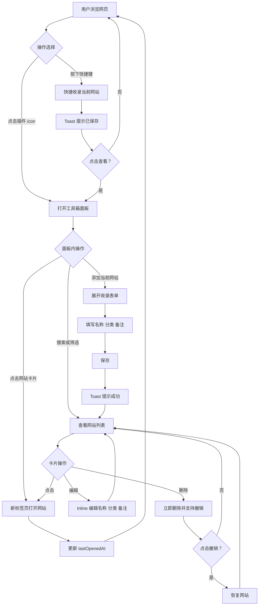

# PinBase 设计文档

## 1. 一句话定位

这是一个给个人用户使用的浏览器插件，用来快速收藏和查找常用网站，解决“记不住网站名称、想用时找不到”的问题。

相比浏览器自带书签，PinBase 的核心差异是：

- 在轻量面板内完成主要操作，不跳出当前工作流
- 支持分类筛选，降低查找成本
- 支持搜索辅助，适合“记得用途但记不清名字”的场景

## 2. 产品形态

- 当前选型：浏览器插件 / 扩展，优先支持 Chromium 内核
- 目标平台：Microsoft Edge、Google Chrome
- 选择理由：
  - 使用场景天然发生在浏览网页时
  - 适合“随手收藏、随时调出”的高频轻量操作
  - 无需独立应用，无需账号体系
  - 数据本地存储，降低复杂度
- 阶段策略：
  - 第一阶段支持 Edge / Chrome
  - 后续如有需要，再评估 Firefox

## 3. 目标用户与使用场景

### 3.1 用户画像

- 核心用户：个人开发者、设计师、知识工作者
- 用户特征：
  - 日常需要频繁访问大量网站
  - 网站很多，但命名记忆不稳定
  - 当前没有系统化整理习惯，或现有书签体系混乱
- 核心痛点：
  - 想找一个常用网站时，经常记不住网站名称
  - 书签栏和收藏夹可用，但维护成本高、查找效率低

### 3.2 典型使用场景

| 场景 | 用户行为 | 期望结果 |
| --- | --- | --- |
| 随手收藏 | 浏览时发现一个有用的网站，按下快捷键或点击添加 | 立即完成收藏，并给出明确反馈，不打断当前工作 |
| 查找网站 | 想打开某个常用网站，但记不清名字 | 打开 PinBase，通过搜索或分类快速找到 |
| 整理分类 | 已收藏了一批相似网站，想统一归档 | 可以把网站放入如“开发”“UI”“笔记”等分类中 |

## 4. 核心用户动线



## 5. 功能清单

### 5.1 MVP 核心功能

- 网站收录
  - 标准收录：面板内表单添加
  - 快捷收录：通过快捷键一键收录
  - URL 去重判断
- 工具箱面板
  - 网站列表展示
  - 搜索功能
  - 分类筛选
- 分类管理
  - 默认分类
  - 新增分类
  - 删除分类
- 网站卡片操作
  - 点击打开
  - Inline 编辑
  - 删除与撤销

### 5.2 后续迭代功能

- 当前页面状态提示（Badge）
- 分类重命名
- URL 搜索
- Firefox 支持

## 6. 关键页面布局线框图

页面主布局改为“顶部操作区 + 左侧分类栏 + 右侧网站卡片网格”的结构，对应目标布局如下：

```text
┌──────────────────────────────────────────────────────────────────────┐
│ [搜索框________________]                           [快捷键提醒]      │
│                                                                      │
│                    [ + 添加当前网站 ]                                 │
├───────────────┬──────────────────────────────────────────────────────┤
│ [全部]        │  [○] 名称                    [×]  [○] 名称      [×] │
│               │      简介                          简介              │
│ [开发]        │                                                      │
│               │  [○] 名称                    [×]  [○] 名称      [×] │
│ [UI]          │      简介                          简介              │
│               │                                                      │
│ [笔记]        │  [○] 名称                    [×]  [○] 名称      [×] │
│               │      简介                          简介              │
│ [其他]        │                                                      │
│               │  卡片区域为两到三列自适应网格，默认展示网站图标、名称、│
│ [+]           │  简介，以及卡片右上角删除入口。点击卡片主体可直接打开。│
└───────────────┴──────────────────────────────────────────────────────┘
```

### 6.1 布局说明

- 顶部第一行为全局操作区，左侧是搜索框，右侧是快捷键提醒
- 顶部第二行为主操作入口，使用居中的“+ 添加当前网站”按钮，突出收录动作
- 下方主体为左右分栏布局
  - 左侧是垂直分类列表，包含全部、开发、UI、笔记、其他，以及新增分类入口
  - 右侧是网站卡片展示区，使用网格排列
- 卡片区优先按三列展示，在面板宽度不足时可降为两列或单列
- 左右区域之间需要明确分割，强化“左侧筛选导航、右侧内容浏览与操作”的信息层级

### 6.2 展开收录表单

```text
┌─────────────────────────────────────────┐
│ 添加网站                           [✕] │
├─────────────────────────────────────────┤
│ 网站名称                                │
│ [ChatGPT_________________________]      │
│                                         │
│ 网站链接（自动获取）                    │
│ https://chat.openai.com                 │
│                                         │
│ 分类                                    │
│ [✓] 开发常用  [ ] UI设计  [ ] 笔记      │
│ [ ] 其他  [+ 新增分类]                  │
│                                         │
│ 备注（可选）                            │
│ [日常AI工具_____________________]       │
│                                         │
│ [取消]                        [保存]    │
└─────────────────────────────────────────┘
```

## 7. 功能详细描述

### 7.1 标准收录

功能描述：用户在面板内通过表单收录当前网页，可编辑名称、选择分类、添加备注。

触发条件：点击面板中的“+ 添加当前网站”按钮。

交互细节：

| 场景 | 处理方式 |
| --- | --- |
| 操作反馈 | 点击后在面板内展开表单，不使用浏览器弹窗 |
| 重复收录 | Toast 提示“该网站已收录”，不展开表单 |
| 保存成功 | Toast 提示“已保存”，表单收起，列表刷新 |
| 保存失败 | Toast 提示“保存失败，请重试” |

状态说明：

| 状态 | 触发条件 | UI 表现 | 用户可执行操作 |
| --- | --- | --- | --- |
| 默认 | 点击添加按钮 | 展开表单，字段预填充 | 编辑名称、分类、备注；取消 |
| 提交中 | 点击保存或按 Enter | 保存按钮显示 loading | 不可重复提交 |
| 成功 | 保存完成 | Toast“已保存”，表单收起 | 继续添加或关闭面板 |
| 失败 | 存储写入失败 | Toast“保存失败” | 重试 |
| 重复 | URL 已存在 | Toast“该网站已收录” | 查看已有记录 |

边界条件：

- 名称建议限制 100 字符
- 备注建议限制 200 字符
- 当前页面 URL 无效时，如 `chrome://` 页面，提示“当前页面无法收藏”
- 网络异常不应影响本地保存流程

数据规范：

| 字段名 | 类型 | 长度限制 | 必填 | 默认值 | 说明 |
| --- | --- | --- | --- | --- | --- |
| `id` | `string` | UUID v4 | 是 | 自动生成 | 唯一标识 |
| `title` | `string` | 1-100 | 是 | 页面标题 | 网站名称 |
| `url` | `string` | 1-2048 | 是 | 当前页面 URL | 原始 URL |
| `normalizedUrl` | `string` | 1-2048 | 是 | normalize 后的 URL | 用于去重 |
| `categories` | `string[]` | 最多 10 个 | 是 | `["其他"]` | 至少包含一个分类 |
| `note` | `string` | 0-200 | 否 | 空字符串 | 备注 |
| `createdAt` | `number` | - | 是 | 时间戳 | 创建时间 |
| `lastOpenedAt` | `number` | - | 是 | 时间戳 | 最近打开时间 |

### 7.2 快捷收录

功能描述：通过快捷键一键收藏当前网页，无需填写表单，自动使用默认值。

触发条件：按下配置好的快捷键，默认 `Alt + Shift + S`。

交互细节：

| 场景 | 处理方式 |
| --- | --- |
| 操作反馈 | Toast 提示“已保存”，并附带“查看”按钮 |
| 重复收录 | Toast 提示“该网站已收录”，不重复保存 |
| 快捷键未配置 | 不触发，无反馈 |

状态说明：

| 状态 | 触发条件 | UI 表现 | 用户可执行操作 |
| --- | --- | --- | --- |
| 成功 | 收录完成 | Toast“已保存” + “查看”按钮 | 点击查看并打开面板 |
| 失败 | 存储写入失败 | Toast“保存失败” | 无 |
| 重复 | URL 已存在 | Toast“该网站已收录” | 无 |
| 无效页面 | `chrome://` 等特殊页 | Toast“当前页面无法收藏” | 无 |

边界条件：

- 快捷键冲突时，提示用户在浏览器扩展设置中重新配置
- 当前页面 URL 无效时，不执行收录

### 7.3 URL Normalize 规则

功能描述：对 URL 进行标准化处理，用于判断是否重复收录。

处理规则：

| 步骤 | 操作 | 示例 |
| --- | --- | --- |
| 1 | 去掉首尾空白 | `https://openai.com` → `https://openai.com` |
| 2 | 移除 hash | `https://openai.com/#test` → `https://openai.com/` |
| 3 | 移除 query 参数 | `https://openai.com/?a=1` → `https://openai.com/` |
| 4 | 移除末尾斜杠，根路径除外 | `https://openai.com/` → `https://openai.com` |
| 5 | 域名转小写 | `https://OpenAI.com` → `https://openai.com` |

以下 URL 视为同一网站：

- `https://openai.com`
- `https://openai.com/`
- `https://openai.com/?a=1`
- `https://openai.com/#test`

### 7.4 工具箱面板

功能描述：插件主界面，展示所有已收藏网站，并支持搜索、筛选和操作。

触发条件：点击浏览器工具栏中的插件 icon。

交互细节：

| 场景 | 处理方式 |
| --- | --- |
| 打开面板 | 默认展示全部网站，按 `lastOpenedAt` 倒序 |
| 空状态 | 显示引导文案与添加按钮，鼓励添加第一个网站 |
| 搜索输入 | 实时过滤，无需按回车 |
| 分类切换 | 立即筛选展示对应网站 |

状态说明：

| 状态 | 触发条件 | UI 表现 | 用户可执行操作 |
| --- | --- | --- | --- |
| 默认 | 打开面板 | 显示全部网站，按最近打开排序 | 搜索、筛选、点击、编辑、删除 |
| 空状态 | 无任何网站 | 空状态插图 + 文案 + 添加按钮 | 添加当前网站 |
| 搜索中 | 输入关键词 | 实时过滤列表 | 继续输入或清空 |
| 筛选中 | 点击分类 | 显示该分类下的网站 | 切换分类或返回全部 |
| 无结果 | 搜索或筛选无匹配 | 提示“没有找到匹配的网站” | 清空搜索或切换分类 |

边界条件：

- 网站数很多时，如超过 500 条，建议使用虚拟滚动
- 搜索词为空时，显示全部网站
- 分类下无网站时，显示空状态提示

### 7.5 搜索

功能描述：按网站名称和备注进行模糊匹配搜索。

触发条件：在面板顶部搜索框输入文本。

交互细节：

| 场景 | 处理方式 |
| --- | --- |
| 输入反馈 | 实时过滤，无需回车 |
| 无匹配 | 显示“没有找到匹配的网站” |
| 清空搜索 | 恢复显示全部网站 |

匹配规则：

- 搜索字段：`title`、`note`
- 匹配方式：不区分大小写的 `includes`
- MVP 不支持 URL 搜索

### 7.6 分类筛选

功能描述：按分类过滤网站列表。

触发条件：点击分类栏中的某个分类。

交互细节：

| 场景 | 处理方式 |
| --- | --- |
| 点击分类 | 立即显示该分类下的所有网站 |
| 多分类网站 | 可出现在多个分类的筛选结果中 |
| 点击“全部” | 恢复显示所有网站 |

默认分类：

| 分类名 | 说明 |
| --- | --- |
| 开发常用 | 默认存在 |
| UI设计 | 默认存在 |
| 笔记 | 默认存在 |
| 其他 | 系统保底分类，不可删除 |

### 7.7 分类管理

功能描述：新增和删除分类。

触发条件：

- 新增：在收录表单或分类区点击“+ 新增分类”
- 删除：在分类设置区域点击删除按钮

交互细节：

| 场景 | 处理方式 |
| --- | --- |
| 新增分类 | 输入分类名，按 Enter 保存，立即生效 |
| 删除分类 | 立即删除，该分类下网站移除该标签 |
| 删除“其他” | 删除按钮禁用，不允许操作 |

边界条件：

- 分类名不能为空
- 分类名不能重复
- 分类名最长 20 字符
- 删除分类后，如果某网站没有任何分类，则自动归入“其他”

数据规范：

| 字段名 | 类型 | 长度限制 | 必填 | 默认值 | 校验规则 |
| --- | --- | --- | --- | --- | --- |
| `name` | `string` | 1-20 | 是 | - | 非空且不重复 |

### 7.8 网站卡片

功能描述：展示单条网站信息，支持点击打开、编辑、删除。

触发条件：面板内容区展示网站卡片时。

交互细节：

| 场景 | 处理方式 |
| --- | --- |
| 点击卡片 | 新标签页打开网站，并更新 `lastOpenedAt` |
| 点击操作菜单 | 展开编辑、删除等操作 |
| 编辑 | Inline 展开，可编辑名称、分类、备注 |
| 删除 | 立即删除，并展示可撤销的 Toast |

状态说明：

| 状态 | 触发条件 | UI 表现 | 用户可执行操作 |
| --- | --- | --- | --- |
| 默认 | 正常展示 | 显示名称、备注、分类标签 | 点击、编辑、删除 |
| 编辑中 | 点击编辑 | Inline 编辑表单 | 修改、保存、取消 |
| 删除中 | 点击删除 | 立即从列表移除 | 撤销 |

### 7.9 删除与撤销

功能描述：删除网站，并在短时间内提供撤销机会。

触发条件：点击卡片上的删除按钮。

交互细节：

| 场景 | 处理方式 |
| --- | --- |
| 删除操作 | 立即删除，不使用确认弹窗 |
| 删除反馈 | Toast“已删除” + “撤销”按钮 |
| 撤销操作 | 点击撤销后，恢复到原位置 |
| Toast 消失 | 3 秒后自动消失，撤销失效 |

边界条件：

- 撤销有效期仅在 Toast 显示期间
- 连续删除时，每次删除都应独立提供撤销机会

### 7.10 当前页面状态提示（Badge）

功能描述：当用户当前浏览的网页已经收录时，插件 icon 显示 Badge。

触发条件：用户切换或加载新页面时。

交互细节：

| 场景 | 处理方式 |
| --- | --- |
| 当前页已收录 | 插件 icon 显示 Badge，如小圆点或数字 |
| 当前页未收录 | 不显示 Badge |
| 特殊页面 | 如 `chrome://` 页面，不显示 Badge |

边界条件：

- 页面 URL 变化时，需要重新判断并更新 Badge
- 即使原始 URL 不同，只要 normalize 后一致，就视为已收录

## 8. 文案规范

### 8.1 整体风格

- 风格基调：简洁、直接、效率导向
- 适用语气：轻提示、少打扰、明确下一步动作

### 8.2 面向终端用户的产品文案

| 场景 | 文案内容 | 风格备注 |
| --- | --- | --- |
| 面板标题 | `PinBase` | 品牌名 |
| 空状态标题 | `还没有收藏任何网站` | 引导性 |
| 空状态说明 | `点击下方按钮，或使用快捷键收藏当前网站` | 说明操作方式 |
| 空状态按钮 | `添加当前网站` | 动词开头 |
| 搜索框占位 | `搜索网站...` | 简洁 |
| 添加按钮 | `+ 添加当前网站` | 动词开头 |
| 保存按钮 | `保存` | 简洁 |
| 取消按钮 | `取消` | 简洁 |
| 删除按钮 | `删除` | 简洁 |
| 编辑按钮 | `编辑` | 简洁 |
| Toast - 已保存 | `已保存` | 正向反馈 |
| Toast - 已删除 | `已删除` | 正向反馈 |
| Toast - 查看 | `查看` | 动词开头 |
| Toast - 撤销 | `撤销` | 动词开头 |
| Toast - 已收录 | `该网站已收录` | 说明情况 |
| Toast - 保存失败 | `保存失败，请重试` | 说明原因 + 下一步 |
| Toast - 无法收藏 | `当前页面无法收藏` | 说明原因 |
| 快捷键提醒 | `快捷键：Alt+Shift+S` | 信息展示 |
| 分类已存在 | `分类已存在` | 说明情况 |
| 无匹配结果 | `没有找到匹配的网站` | 说明情况 |

## 9. 非功能性需求

### 9.1 性能要求

- 面板打开时间：小于 100ms
- 列表滚动：60fps，无明显卡顿
- 搜索响应：小于 50ms

### 9.2 权限控制

- 无需登录
- 无角色区分
- 仅限本地使用

### 9.3 兼容性

- 浏览器：Microsoft Edge、Google Chrome
- 最低版本：Chromium 88+，支持 Manifest V3

### 9.4 数据安全

- 数据完全本地存储
- 不上传任何数据到服务端
- 不接入第三方服务

### 9.5 数据存储

- 存储方式：`chrome.storage.local`
- 单条网站数据体积：约 500 bytes
- 预估容量：支持 1000+ 网站
- 数据保留：永久本地保留，除非用户卸载插件
